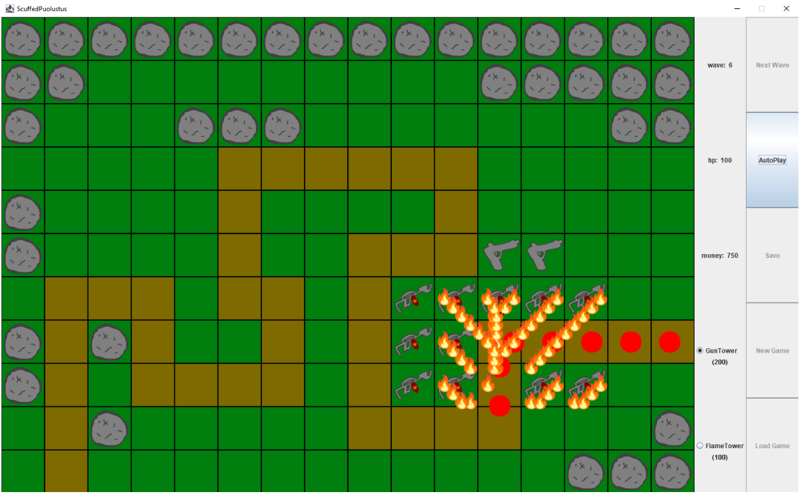
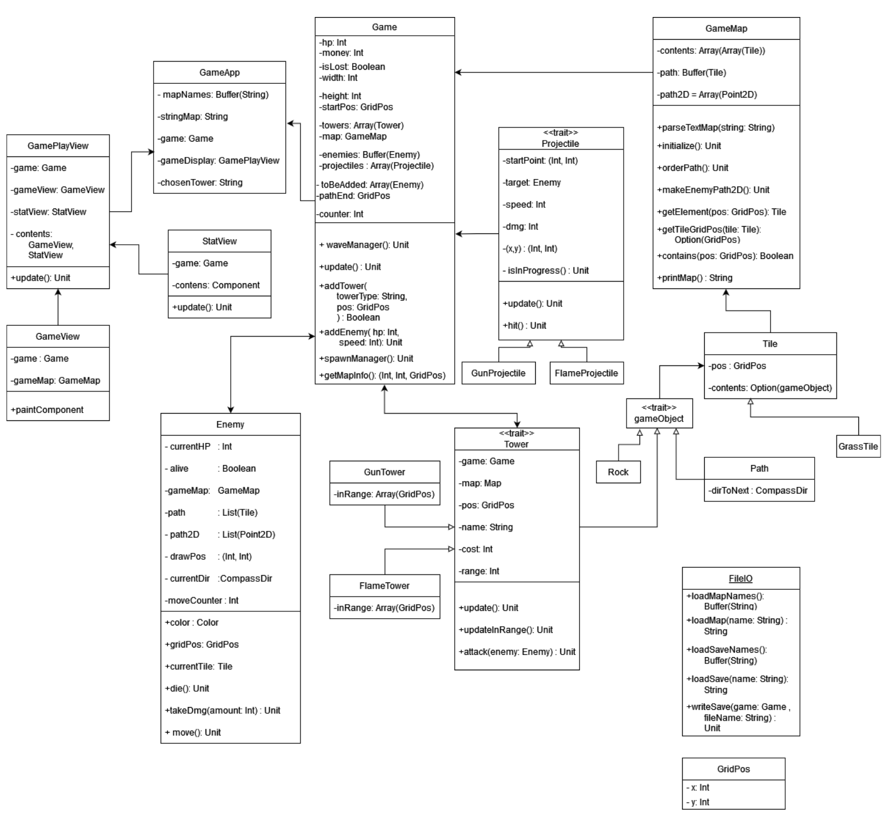

# ScuffedPuolustus

A simple tower defence game

# Running the game

You must have jdk8, Scala 3.1.3 and Scala sbt installed

Open a cmd in the project root
run

```
$ sbt
$ run
```

# Yleiskuvaus

Ohjelma on yksinkertainen tornipuolustuspeli, jossa pelaaja pyrkii estämään vihollisia pääsemästä reitin
loppuun. Pelaaja saa rahaa tuhoamalla vihollisia, ja saadulla rahalla pelaaja voi asettaa lisää torneja.
Vihollisten määrä ja vahvuus kasvavat jokaisella kierroksella. Peli on toteutettu vaativalla -tasolla.

# Käyttöohje

Ohjelma aukeaa uuteen peliin. Pelaaja voi valita, haluaako aloittaa seuraavan vihollisaallon, aloittaa uuden
pelin vai ladata tallennetun pelin. Pelaaja voi asettaa uusia torneja kartalle, valitsemalla ensin vasemmalta
haluamansa tornityypin, ja sitten painamalla hiiren vasenta näppäintä haluamansa ruudun kohdalla. Pelaaja
näkee hp:n ja raha tilanteensa vasemmalla, ja voi laittaa autoplay:n päälle napista, jolloin peli jatkaa
automaattisesti seuraavaan vihollisaaltoon.
Pelaaja voi tallentaa pelin vihollisaaltojen välissä, painamalla save -nappia, ja kirjoittamalla tekstikenttään
nimen tiedostolle.
Pelaaja voi avata tallennetun pelin painamalla load -nappia, ja valitsemalla listasta haluamansa pelin.



# Ohjelman rakenne



Tornit etsivät ensimmäisen hyökkäysetäisyydellään olevan vihollisen Game -luokan enemies -listasta, joka
on järjestetty Enemy -luokan moveCounterin mukaan, jolloin tornit hyökkäävät aina reitillä pisimmällä
edenneeseen viholliseen.

Viholliset liikkuvat GameMap -luokan path2D listan mukaan, jokaisella päivityksellä moveCounter kasvaa,
jonka avulla vihollinen valitsee seuraavan pisteen listalta.

Projektiilit liikkuvat laskemalla koordinaatti eron sijaintinsa ja kohteensa välillä, ja muuttamalla sitten
paikkaansa nopeutensa verran.

Peli luo uusia vihollisia riippuen kierroksesta. Vihollisten vahvuus riippuu myös kierroksesta.

Kartta alustetaan lukemalla tiedostosta haetusta tekstistä, mitä kartan tiilillä kuuluisi olla. Kartta asettaa
tiilien contents -muuttujaan niille kuuluvan objektin. Vihollisten reitti on kirjoitettu kirjaimilla, jotka
vastaavat ilmansuuntaa seuraavaan reittipalaan. Tällöin vain reitin alun koordinaatit tarvitsee tallentaa.
Tornit on myös tallennettu vastaavilla kirjaimilla.

# Tiedostot

Ohjelma käyttää tekstitiedostoja karttojen ja tallennettujen pelien esittämiseen.
Ohjelma käyttää kuvatiedostoja tiilien ja tornien piirtämiseen.
Karttaa kuvaavassa tiedostossa jokainen tiili saa kirjaimen, joka kuvaa mitä tiilellä on
esim:

```
RAASAAAARRRR
AAASAAAAARRR
AAASRAAAAAAR
AAAEESRAAAAR
ARRAASAAAARR
AASWWWAAAAAR
AASAEESAAAAA
AAEENASAAAAA
AAAAAASAAAAA
AAAAAASAAAAA
#12100401
```

jossa alimmalla rivillä ovat tiedot kartan koosta ja reitin alkupiste.
R = Kivi
A = Tyhjä
E, W, N, S = Reittitiili, jossa kirjain osoittaa seuraavan reittitiilen ilmansuuntaan. Viimeinen reittitiili osoittaa
ulos kartasta.
Tallennettua peliä kuvaavassa tiedostossa ovat tiedot pelaajan hp:sta, rahasta ja kartan tilanteesta.
esim:

```
R10
S
RRRRRRRRRRRRRRRR
RRAAAAAAAAARRRRR
RAAARRRAAAAAAARR
AAAAASWWWWWAAAAA
RAAAASAAAANAAAAA
RAAAASAAEENGGGGG
ASWWAESANFFFFFFF
RSRNAASANFFSWWWW
RSANWWWANFFSFFGG
ASRAAAAANWWWGGGR
ASAAAAAAAGGGGRRR
#16111608
M960
H100
```

jossa ylimpänä on tallennushetken kierros, sen jälkeen kartan tilanne, raha ja hp.
G = GunTower
F = FlameTower
